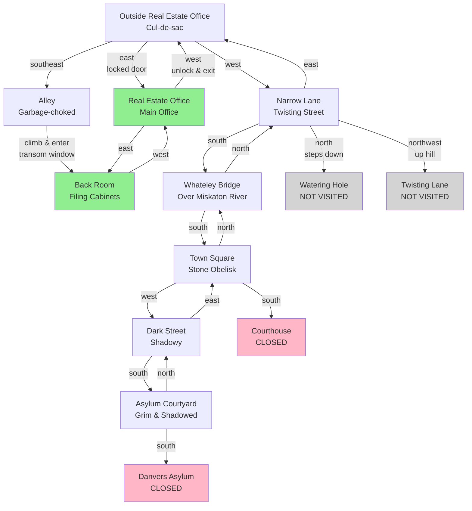

# Anchorhead Map

This map shows the locations discovered during gameplay, with connections between them.

## Discovered Locations

## Legend

- **Green**: Accessible indoor locations
- **Red**: Closed/inaccessible locations
- **Gray**: Mentioned but not yet visited
- **Blue**: Standard locations

## Key Discoveries

### Outside Real Estate Office
- Starting location
- Narrow cul-de-sac with real estate office to the east
- Alley to southeast (key to entering)

### Alley
- Contains garbage cans and transom window
- Used garbage can to climb and enter through window
- Alternative entrance to the real estate office

### Real Estate Office (Back Room)
- Filing cabinets with property records
- **Found**: Verlac property keys (house key + cellar key)
- Verlac file was cleaned out (suspicious)

### Real Estate Office (Main Office)
- Answering machine with mysterious message
- Voice whispering "Verlac" through static
- Locked desk drawer
- Office deserted with cold coffee

### Town Square
- Central location with stone obelisk monument
- Obelisk has hieroglyphs and iron ring near top
- Municipal courthouse (closed)
- Multiple exits to explore

### Whateley Bridge
- Ancient, crumbling bridge over Miskaton River
- Connects north and south sections of city

### Danvers Asylum
- White-washed building with barred windows
- Currently closed
- Ominous atmosphere

## Current Status

**Location**: Asylum Courtyard (outside Danvers Asylum)

**Inventory**:
- Wedding ring (worn)
- Trenchcoat (worn)
- Clothes (worn)
- Umbrella (in hand)
- Keyring with 2 keys:
  - Key to the house
  - Key to the cellar

## Unexplored Areas

- Watering hole (north from Narrow Lane)
- Twisting lane up the hill (northwest from Narrow Lane)
- Avenue east from Town Square
- Dark alley southwest from Town Square
- The Verlac house (destination - need to find it!)
