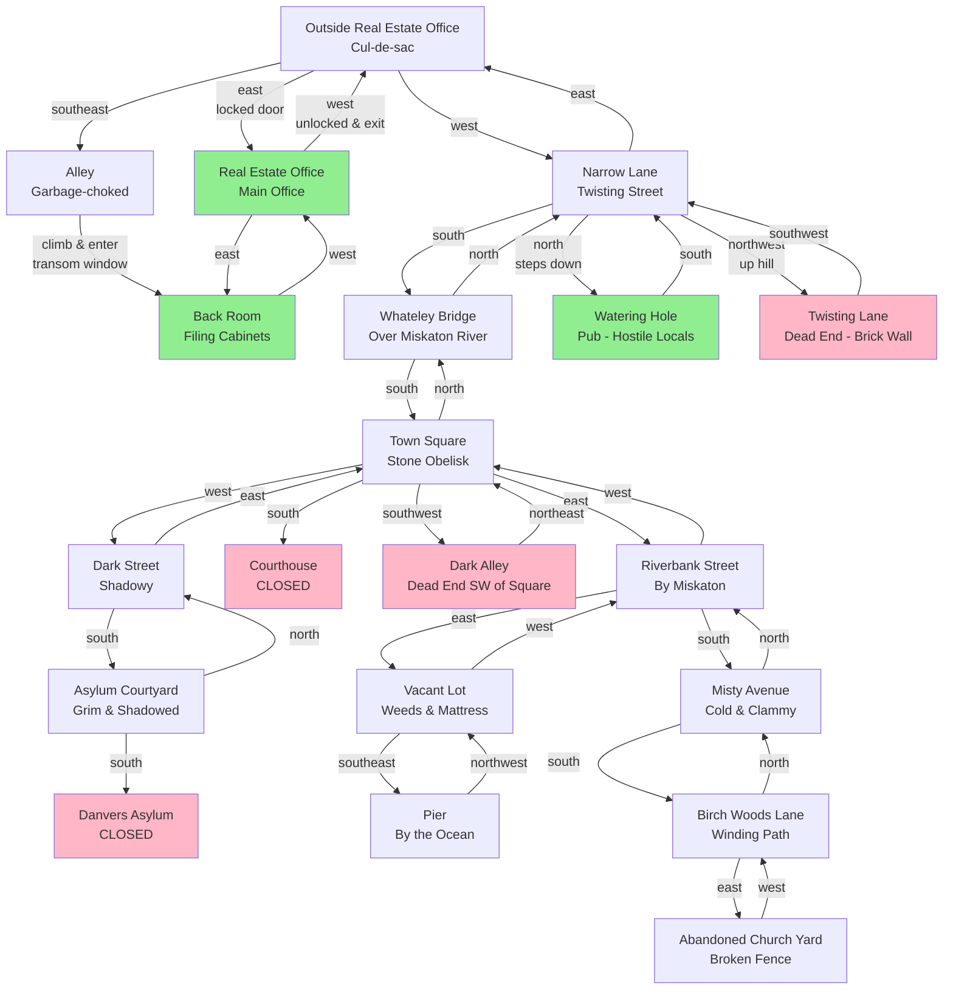

# Anchorhead Map

This map shows the locations discovered during gameplay, with connections between them.

## Discovered Locations

## Legend

- **Green**: Accessible/visited indoor locations
- **Red**: Closed/inaccessible/dead-end locations
- **Blue**: Standard outdoor locations

## Key Discoveries

### Outside Real Estate Office
- Starting location
- Narrow cul-de-sac with real estate office to the east
- Alley to southeast (used to enter office)

### Alley
- Garbage-choked alley with tall wooden fence
- Contains metal garbage cans and transom window
- Pushed garbage can to wall and climbed to reach window
- Alternative entrance to the real estate office

### Real Estate Office (Back Room)
- Filing cabinets with hundreds of property records
- Too many files to browse without specific search
- Accessed via transom window

### Real Estate Office (Main Office)
- **Answering machine**: Mysterious message with voice whispering "Verlac" through static
- Locked desk drawer (could not open)
- Papers scattered on desk (nothing useful found)
- Cold, half-finished coffee (Miss Benson left suddenly)
- Office was deserted and locked

### Town Square
- Central location with stone obelisk monument
- **Obelisk**: 15 feet tall, covered in worn hieroglyphs, iron ring embedded near top
- Municipal courthouse (closed for the day)
- Multiple exits to all sections of town

### Whateley Bridge
- Ancient, crumbling bridge over Miskaton River
- Moss-eaten flagstones, occasionally drops mortar into water
- Connects north and south sections of city

### Danvers Asylum
- White-washed edifice with barred windows
- Motto: "Health, Discipline, Tranquillity" with caduceus symbol
- Oppressive, claustrophobic atmosphere
- Currently closed for the day

### Watering Hole (Pub)
- Dank drinking hole lit by oil-burning lanterns
- Mill workers and fishermen drinking in silence
- **Important**: Mentioned Verlac family - locals became hostile and silent
- One local warned: "Some things best left alone by outsiders"
- **Found**: Flask of rotgut spirits under a table

### Pier
- Wooden pier at ocean's edge
- Few boats tied up (fishing industry mostly dead)
- **Found**: Old tin of fish oil from Skagen, Denmark

### Abandoned Church
- Dark, abandoned building in the woods
- Wrought-iron fence bent at crazy angles
- Overgrown with weeds
- Path leads around to the southeast (not explored)

## Current Status

**Location**: Outside Real Estate Office (Cul-de-sac)

**Inventory**:
- Wedding ring (worn)
- Trenchcoat (worn)
- Clothes (worn)
- Umbrella (in hand)
- Flask of rotgut spirits (closed) - found in pub
- Old tin of fish oil (closed) - found at pier

**Next Steps**: Waiting for Michael to return and pick me up

## Unexplored Areas

- Path around abandoned church to the southeast
- South continuation of Birch Woods Lane (deeper into forest)
- Southwest dirt road from Misty Avenue
- Steps down to riverbank (gate on Riverbank Street)
- The Verlac house (destination - have not received keys yet)

## Notes

- Miss Benson (real estate agent) is missing - office was locked and deserted
- No keys found in the office (desk drawer locked)
- The Verlac family name causes fear and hostility among locals
- Town has oppressive, decaying atmosphere
- Many buildings are closed or abandoned
- Weather: cold rain, green lightning in storm clouds
